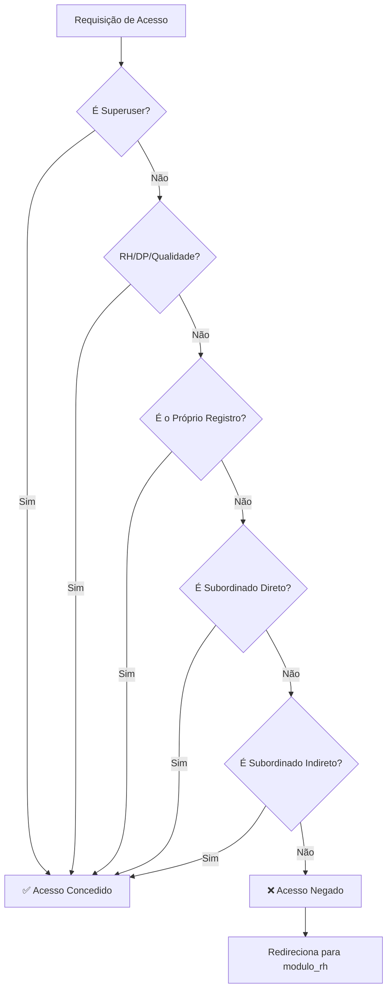

# Implementação de Controle de Acesso - RH Module

## Resumo Executivo

Implementamos um sistema robusto de controle de acesso no módulo de RH que garante que cada usuário veja apenas suas próprias informações ou as de seus subordinados diretos/indiretos.

## Arquitetura de Permissões

### Hierarquia de Verificação

A função auxiliar `can_user_access_colaborador(request_user, target_colaborador)` implementa a seguinte hierarquia:

```
1. SUPERUSER → Acesso Total
   └─ request_user.is_superuser == True
   
2. RH/DP/QUALIDADE → Acesso Total
   └─ Usuário trabalha em setor com "RH", "DP" ou "QUALIDADE" no nome
   
3. PRÓPRIO REGISTRO → Acesso Permitido
   └─ request_user.colaborador.id == target_colaborador.id
   
4. SUBORDINADOS DIRETOS → Acesso Permitido
   └─ target_colaborador.lider == request_user.colaborador
   └─ target_colaborador.supervisor == request_user.colaborador
   └─ target_colaborador.gerente == request_user.colaborador
   
5. SUBORDINADOS INDIRETOS → Acesso Permitido
   └─ target_colaborador.id in get_all_subordinates(request_user.colaborador)
```

## Views Atualizadas

### 1. `detalhe_colaborador_view(request, colab_id)`
- **Função**: Visualiza detalhes completos do colaborador
- **Alteração**: Agora checa `can_user_access_colaborador()` antes de exibir dados
- **Redirecionamento**: Redireciona para `modulo_rh` se acesso negado
- **Status**: ✅ Atualizada

### 2. `editar_colaborador_view(request, colab_id)`
- **Função**: Edita dados do colaborador
- **Alteração**: Implementa verificação de acesso antes de permitir edição
- **Redirecionamento**: Redireciona para `modulo_rh` se acesso negado
- **Status**: ✅ Atualizada

### 3. `registrar_ocorrencia_view(request)`
- **Função**: Registra nova ocorrência de RH
- **Alterações**:
  - Verifica acesso ao colaborador pré-selecionado via GET `colab_id`
  - Verifica acesso ao colaborador selecionado no formulário POST
  - Rejeita registro se usuário não tem acesso ao colaborador
- **Status**: ✅ Atualizada

### 4. `editar_ocorrencia_view(request, occ_id)`
- **Função**: Edita ocorrência existente
- **Alteração**: Checa acesso ao colaborador da ocorrência antes de permitir edição
- **Redirecionamento**: Redireciona para `modulo_rh` se acesso negado
- **Status**: ✅ Atualizada

### 5. `deletar_ocorrencia_view(request, occ_id)`
- **Função**: Exclui ocorrência
- **Alteração**: Checa acesso ao colaborador da ocorrência antes de permitir exclusão
- **Redirecionamento**: Redireciona para `modulo_rh` se acesso negado
- **Status**: ✅ Atualizada

## Mensagens de Erro Padronizadas

Quando acesso é negado, o sistema exibe:

```
"Acesso Negado. Você não tem permissão para [ação] este colaborador."
```

Exemplos:
- "Acesso Negado. Você não tem permissão para ver este colaborador."
- "Acesso Negado. Você não tem permissão para editar este colaborador."
- "Acesso Negado. Você não tem permissão para registrar ocorrências para este colaborador."
- "Acesso Negado. Você não tem permissão para editar ocorrências deste colaborador."
- "Acesso Negado. Você não tem permissão para deletar ocorrências deste colaborador."

## Casos de Uso Cobertos

### Cenário 1: Superuser
- **Permissão**: Acesso total a todos os colaboradores
- **Resultado**: Pode visualizar, editar e gerenciar ocorrências de qualquer colaborador

### Cenário 2: Usuário RH/DP/Qualidade
- **Permissão**: Acesso total a todos os colaboradores
- **Resultado**: Pode visualizar, editar e gerenciar ocorrências de qualquer colaborador

### Cenário 3: Gerente
- **Permissão**: Acesso próprio + subordinados diretos + subordinados indiretos
- **Resultado**: Pode gerenciar informações de sua equipe hierárquica

### Cenário 4: Supervisor
- **Permissão**: Acesso próprio + subordinados diretos
- **Resultado**: Pode visualizar e editar dados de sua equipe

### Cenário 5: Líder
- **Permissão**: Acesso próprio + colaboradores que o tem como líder
- **Resultado**: Supervisão limitada de sua equipe

### Cenário 6: Colaborador Comum
- **Permissão**: Acesso somente a dados próprios
- **Resultado**: Pode visualizar apenas suas informações

## Detalhes Técnicos

### Função `can_user_access_colaborador()`
**Localização**: [rh/views/views.py](rh/views/views.py#L43-L95)

**Implementação**:
```python
def can_user_access_colaborador(request_user, target_colaborador):
    """
    Verifica se um usuário tem permissão para acessar um colaborador específico.
    
    Hierarquia:
    1. Superuser → sempre tem acesso
    2. RH/DP/Qualidade → sempre tem acesso
    3. Próprio registro → tem acesso
    4. Líder/Supervisor/Gerente do alvo → tem acesso
    5. Gerente indireto (através da hierarquia) → tem acesso
    """
```

### Função Auxiliar `get_all_subordinates()`
Recupera todos os subordinados diretos e indiretos de um colaborador:

```python
def get_all_subordinates(colaborador):
    """
    Retorna lista de IDs de todos os subordinados (diretos e indiretos).
    """
```

## Fluxo de Verificação



## Testes Recomendados

### Teste 1: Superuser
- [ ] Pode visualizar todos os colaboradores
- [ ] Pode editar qualquer colaborador
- [ ] Pode registrar ocorrências para qualquer pessoa

### Teste 2: RH/DP/Qualidade
- [ ] Pode visualizar todos os colaboradores
- [ ] Pode editar qualquer colaborador
- [ ] Pode registrar/editar/deletar ocorrências

### Teste 3: Gerente
- [ ] Pode visualizar apenas sua equipe
- [ ] Acesso negado para outros gerentes
- [ ] Pode editar subordinados

### Teste 4: Supervisor
- [ ] Pode visualizar apenas sua equipe imediata
- [ ] Acesso negado para colegas
- [ ] Acesso negado para outras hierarquias

### Teste 5: Colaborador Comum
- [ ] Pode visualizar apenas seu próprio perfil
- [ ] Acesso negado para colegas
- [ ] Acesso negado para qualquer edição

## Benefícios

✅ **Segurança**: Dados protegidos contra acesso não autorizado  
✅ **Escalabilidade**: Sistema hierárquico suporta crescimento organizacional  
✅ **Auditoria**: Todas as operações respeitam hierarquia definida  
✅ **Consistência**: Mesma lógica aplicada em todas as views  
✅ **Manutenibilidade**: Função centralizada facilita futuras alterações  

## Próximos Passos

1. **Testes Unitários**: Criar testes para `can_user_access_colaborador()`
2. **Testes de Integração**: Validar fluxo completo de acesso
3. **Auditoria**: Registrar tentativas de acesso negado
4. **Documentação de Usuário**: Criar guia para gestores sobre hierarquia

## Histórico de Alterações

| Data | Versão | Alteração |
|------|--------|-----------|
| 2024 | 1.0 | Implementação inicial de controle de acesso |

---

**Status**: ✅ Implementação Completa  
**Arquivo Principal**: [rh/views/views.py](rh/views/views.py)
