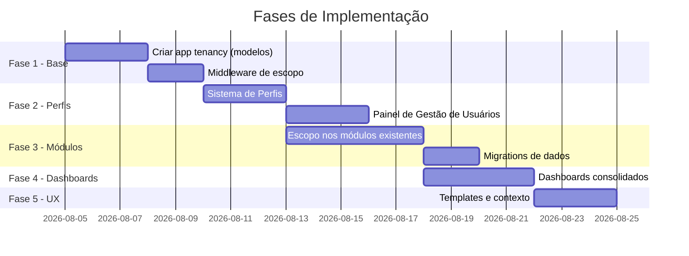

# CalibraWeb — Transformação Multi-Empresarial e Multi-Regional

## Objetivo

Transformar o CalibraWeb de um sistema mono-laboratório em uma plataforma **multi-empresarial (multi-laboratorial)** e **multi-regional**, com suporte a múltiplos laboratórios por região. A mudança deve se estender a todos os módulos existentes e incluir um sistema de **Perfis de Usuário** com regras de negócio embutidas, garantindo que cada nível hierárquico (Diretoria Nacional, Gerência Nacional, Gerência Regional e Gestão Laboratorial) veja e acesse apenas o que lhe compete.

---

## Contexto Atual

O sistema já possui:
- Módulos: Metrologia, Treinamentos, Pessoas (RH), Ações Corretivas, Fornecedores, Auditoria, Laboratório (Ocorrências + Coating), Quadros, Usuários.
- Sistema de permissões granular via `core.NavigationPermission` com flags `nav_mod_*`, `nav_bloco_*` e permissões por função.
- Grupos legados de acesso por módulo (`MODULES_PERMISSIONS`).
- Estrutura de `Colaborador` ligada a `Setor` e `CentroCusto` no app `organization`.
- Estrutura hierárquica via `HierarquiaSetor` (Líder, Supervisor, Gerente, Diretor).
- Usuários Django (`auth.User`) associados a `Colaborador` via OneToOneField.

O sistema **não possui** atualmente:
- Conceito de **Empresa/Grupo** que agrupa laboratórios.
- Conceito de **Região** que agrupa laboratórios dentro de uma empresa.
- Conceito de **Laboratório** como entidade isolada com seus próprios dados.
- **Escopo de visibilidade** por tenant (dado visto depende da empresa/região/lab do usuário).
- **Perfis de Usuário** com regras de negócio embutidas.

---

## Arquitetura Proposta

### Hierarquia de Entidades

```
Empresa (Grupo)
  └── Região
        └── Laboratório (unidade operacional)
              └── Colaboradores / Dados do módulo
```

### Estratégia de Multi-Tenancy

Utilizaremos **Row-Level Tenancy** (isolamento a nível de linha de banco de dados), mantendo um único banco de dados. Cada entidade de dado relevante receberá uma ForeignKey para `Laboratorio`. Views e querysets serão filtrados automaticamente via **middleware de escopo** e um **mixin de queryset**.

Esta abordagem é a de menor risco e menor ruptura com o código existente, pois não exige separação de schemas ou bancos distintos.

---

## User Review Required

> [!NOTE]
> **Decisão de escopo de dados** — ✅ Confirmado: Será adotada a estratégia **Row-Level Tenancy** (isolamento por linha de banco de dados), por ser a abordagem mais segura e compatível com o código existente. Características desta escolha:
> - **Banco único** — sem separação de schemas ou instâncias de banco
> - **Zero reescrita de migrations** — apenas novas ForeignKeys adicionadas progressivamente
> - **Rollback seguro** — qualquer fase pode ser revertida sem perda de dados
> - **Compatibilidade total** com o sistema de permissões `nav_*` já existente
> - Filtragem automática via **middleware de escopo** + **mixin de queryset** em todas as views

> [!NOTE]
> **Dados históricos existentes** — ✅ Confirmado: Todos os dados atuais serão associados ao **Laboratório: Tecnolens** durante a migration de dados (Fase 6). A migration criará automaticamente a cadeia `Empresa → Região → Tecnolens` e vinculará todos os registros existentes a esse laboratório.

> [!NOTE]
> **Módulos a escopo** — ✅ Confirmado:
> - **Metrologia**: escopo por laboratório ✓
> - **Treinamentos**: escopo por laboratório ✓
> - **Pessoas/RH**: escopo por laboratório ✓
> - ~~**Ações Corretivas**~~: **removido do escopo** — módulo será reconstruído do zero em momento futuro
> - **Fornecedores**: escopo por **Região e Laboratório** — usuários de nível Regional veem fornecedores de toda a região; usuários de nível Laboratorial veem apenas os do seu lab ✓
> - **Auditoria**: escopo por laboratório ✓
> - **Laboratório (Ocorrências/Coating)**: escopo por laboratório ✓
> - **Quadros**: escopo por **Região e Laboratório** — mesma lógica do Fornecedores; boards marcados como regionais são visíveis para toda a região ✓

---

## Open Questions — ✅ Todas Resolvidas

| # | Pergunta | Decisão |
|---|----------|---------|
| 1 | Nomenclatura da raiz | **"Empresa"** — regiões são administrativas/personalizadas por empresa |
| 2 | Perfil Admin do Sistema | **Sim** — perfil `ADMIN_SISTEMA` será criado (acima do Diretor Nacional) |
| 3 | Usuário com múltiplos labs | **Sim** — `UsuarioPerfil` terá ManyToMany de laboratórios; o usuário pode alternar contexto |
| 4 | Comportamento no login | **Seletor de contexto** — o usuário escolhe qual lab/região quer visualizar após login |
| 5 | Fornecedores e Quadros | **Escopo por Laboratório** com mecanismo de **compartilhamento** explícito entre labs/regiões |

---

## Proposed Changes

### Fase 1 — Estrutura Base de Multi-Tenancy

#### [NEW] `tenancy/` — App de Tenancy

Novo app Django responsável pela hierarquia organizacional ampliada.

##### [NEW] `tenancy/models.py`
```
Empresa
  - nome (CharField)
  - cnpj (CharField, unique)
  - logo (ImageField, optional)
  - ativo (BooleanField)
  - criado_em / atualizado_em

Regiao
  - empresa (FK → Empresa)
  - nome (CharField)
  - sigla (CharField, max 10)
  - ativo (BooleanField)
  - responsavel (FK → auth.User, null)
  - Meta: unique_together(empresa, nome)

Laboratorio
  - regiao (FK → Regiao)
  - nome (CharField)
  - codigo (CharField, unique por empresa)
  - cnpj (CharField, null/blank)
  - endereco (TextField, null)
  - ativo (BooleanField)
  - responsavel (FK → auth.User, null)
  - Meta: unique_together(regiao, codigo)
```

##### [NEW] `tenancy/middleware.py`
Middleware `TenancyScopeMiddleware` que, após autenticação, resolve o escopo do usuário (lab, região, empresa, nacional) e injeta em `request.tenant_scope`:
```python
request.tenant_scope = {
    "nivel": "LABORATORIAL" | "REGIONAL" | "NACIONAL" | "DIRETORIA",
    "laboratorio": <Laboratorio obj or None>,
    "regiao": <Regiao obj or None>,
    "empresa": <Empresa obj or None>,
    "laboratorio_ids": [list of visible lab ids],
}
```

##### [NEW] `tenancy/mixins.py`
`TenantQuerysetMixin`: mixin para class-based views que filtra automaticamente querysets pelo escopo do usuário.

`TenantRequiredMixin`: mixin para garantir que o usuário tem escopo configurado antes de acessar views.

##### [NEW] `tenancy/admin.py`
Admin para Empresa, Regiao e Laboratorio com visualização hierárquica.

---

### Fase 2 — Perfis de Usuário com Regras de Negócio

#### [MODIFY] `shared/permissions.py`

Adicionar o sistema de **Perfis de Usuário** que encapsulam conjuntos de permissões `nav_*` e regras de negócio, substituindo a atribuição manual permissão a permissão.

##### Perfis Planejados (8 Perfis)

| Perfil | Nível | Escopo de Visão | Criar | Editar | Excluir |
|--------|-------|-----------------|-------|--------|---------|
| `ADMIN_SISTEMA` | Global | Tudo (todas as empresas) | ✅ | ✅ | ✅ |
| `DIRETOR_NACIONAL` | Nacional | Todos os labs da empresa | ❌ | ❌ | ❌ |
| `GERENTE_NACIONAL` | Nacional | Todos os labs da empresa | ✅ Config | ✅ Config | ❌ |
| `GERENTE_REGIONAL` | Regional | Labs da região (multi-lab) | ✅ Lab | ✅ Lab | ❌ |
| `GESTOR_LABORATORIAL` | Multi-Lab | Labs configurados | ✅ | ✅ | ✅ |
| `OPERADOR` | Laboratorial | Um ou mais labs | ✅ | ✅ | ❌ |
| `AUDITOR` | Configurável | Labs configurados | ❌ | ❌ | ❌ |
| `VISUALIZADOR` | Configurável | Labs/Regiões configuradas | ❌ | ❌ | ❌ |

##### [NEW] `tenancy/profiles.py`
```python
# Define o conjunto de nav_* permissions por perfil
PERFIL_PERMISSIONS = {
    "ADMIN_SISTEMA": [
        # TUDO — todas as permissões nav_* do sistema
        # Único perfil com acesso ao cadastro de Empresas, Regiões e Labs
        "core.nav_mod_tenancy", "core.nav_tenancy_empresas",
        "core.nav_tenancy_empresa_create", "core.nav_tenancy_empresa_update",
        "core.nav_tenancy_regioes", "core.nav_tenancy_laboratorios",
        "core.nav_tenancy_perfis_usuario",
        # ... + todas as permissões dos outros perfis
    ],
    "DIRETOR_NACIONAL": [
        # Dashboards nacionais + visão consolidada (todos os módulos, somente leitura)
        "core.nav_visao_consolidada_nacional",
        "core.nav_metrologia_dashboard", "core.nav_metrologia_lista_instrumentos",
        # ... permissões de view/dashboard, SEM create/edit/delete
    ],
    "GERENTE_NACIONAL": [
        # Dashboards nacionais + configurações globais (ex: categorias, modelos de auditoria)
        "core.nav_visao_consolidada_nacional",
        # ... view + create/edit em tabelas de configuração
    ],
    "GERENTE_REGIONAL": [
        # Dashboard regional + acesso operacional completo nos labs da região
        "core.nav_visao_consolidada_regional",
        # ... view + create/edit (SEM delete)
    ],
    "GESTOR_LABORATORIAL": [
        # Acesso operacional pleno nos labs configurados
        # ... view + create + edit + delete dentro do escopo
    ],
    "OPERADOR": [
        # Registro e consulta — SEM delete
        # ... view + create + edit
    ],
    "AUDITOR": [
        # Somente leitura em Auditoria, Metrologia e Treinamentos
        # ... apenas view e export
    ],
    "VISUALIZADOR": [
        # Somente leitura geral no escopo configurado
        # ... apenas view
    ],
}

def apply_profile_to_user(user, profile_key):
    """Aplica um perfil de permissões nav_* a um usuário."""
    ...

def remove_profile_from_user(user):
    """Remove todas as permissões nav_* de um usuário."""
    ...
```

#### [NEW] `tenancy/models.py` — `UsuarioPerfil` + `UsuarioLaboratorioAcesso`

Como um usuário pode ter acesso a **múltiplos laboratórios**, o modelo é dividido em dois:

```
UsuarioPerfil
  - user (OneToOneField → auth.User)
  - perfil (CharField, choices=PERFIL_CHOICES)
  - empresa (FK → Empresa, null)         # Para ADMIN/DIRETOR/GERENTE_NACIONAL
  - regiao (FK → Regiao, null)           # Para GERENTE_REGIONAL
  - laboratorio_primario (FK → Laboratorio, null) # Lab padrão ao fazer login
  - ativo (BooleanField)
  - criado_em / atualizado_em
  - atualizado_por (FK → auth.User, null)

UsuarioLaboratorioAcesso
  # Tabela de associação: quais labs extras o usuário pode acessar
  - usuario_perfil (FK → UsuarioPerfil)
  - laboratorio (FK → Laboratorio)
  - pode_editar (BooleanField, default=True)
  - Meta: unique_together(usuario_perfil, laboratorio)
```

> [!NOTE]
> O `laboratorio_primario` define o contexto padrão exibido ao logar. Através do **seletor de contexto** (header da UI), o usuário pode alternar para qualquer lab em `UsuarioLaboratorioAcesso` ou para a visão consolidada da região/empresa.

#### [NEW] `tenancy/models.py` — `ContextoSessao`
```
ContextoSessao
  # Armazena o contexto ativo na sessão do usuário (qual lab/região está "selecionado")
  # Salvo em session['tenant_contexto'] — não precisa de model, apenas session key
```

#### [MODIFY] `core/models.py` — `NavigationPermission`

Adicionar novas permissões `nav_*` para:
- Visão consolidada nacional e regional
- Gerenciamento de empresas, regiões e laboratórios
- Gerenciamento de perfis de usuário

```python
# Novos codenames:
("nav_mod_tenancy", "NAV: Módulo Tenancy / Gestão Organizacional"),
("nav_tenancy_empresas", "NAV: Tenancy / Lista de Empresas"),
("nav_tenancy_empresa_create", "NAV: Tenancy / Nova Empresa"),
("nav_tenancy_empresa_update", "NAV: Tenancy / Editar Empresa"),
("nav_tenancy_regioes", "NAV: Tenancy / Lista de Regiões"),
("nav_tenancy_laboratorios", "NAV: Tenancy / Lista de Laboratórios"),
("nav_tenancy_perfis_usuario", "NAV: Tenancy / Gestão de Perfis de Usuário"),
("nav_visao_consolidada_nacional", "NAV: Visão Consolidada Nacional"),
("nav_visao_consolidada_regional", "NAV: Visão Consolidada Regional"),
```

---

### Fase 3 — Escopo de Dados nos Módulos Existentes

Para cada módulo, será adicionado um campo `laboratorio (FK → tenancy.Laboratorio)` nas entidades principais e os querysets serão filtrados.

#### [MODIFY] `organization/models.py`
- `Setor` → adicionar `laboratorio (FK)`
- `CentroCusto` → herda escopo via Setor

#### [MODIFY] `rh/models.py`
- `Colaborador` → adicionar `laboratorio (FK)`
- Queryset padrão filtrado por lab do usuário logado

#### [MODIFY] `metrologia/models.py`
- `Instrumento` → adicionar `laboratorio (FK)`
- `HistoricoCalibração` → herda via Instrumento
- `SolicitacaoCotacao` → adicionar `laboratorio (FK)`

#### [MODIFY] `laboratorio/models.py`
- `CategoriaLaboratorio` → adicionar `laboratorio (FK)` (categorias por lab)
- `OcorrenciaLaboratorio` → adicionar `laboratorio (FK)`
- `TurnoCoating`, `RegistroCoating` → adicionar `laboratorio (FK)`
- `EquipeCoating` → escopo via Colaborador

#### [MODIFY] `training/models.py`
- Modelos de Treinamento → adicionar `laboratorio (FK)`
- Matrizes de competência → escopo por lab

#### [MODIFY] `auditoria/models.py`
- `ModeloAuditoria` → `laboratorio (FK)` (modelos globais: lab=None, modelo do lab: lab definido)
- `RegistroAuditoria` → `laboratorio (FK)`

> [!WARNING]
> **Módulo Ações Corretivas — REMOVIDO DO ESCOPO**
> O módulo de Ações Corretivas foi excluído deste plano de implementação. A decisão é reconstruí-lo do zero em uma etapa futura, após revisão completa do seu design. Nenhuma alteração de escopo ou migration deve ser aplicada ao módulo `acoes` neste ciclo.

#### [MODIFY] `fornecedores/models.py`

O modelo de Fornecedor ganha um campo `nivel_escopo` que define em qual nível ele foi cadastrado. A visibilidade é determinada por esse campo, sem necessidade de tabela de compartilhamento:

```
Fornecedor
  - nivel_escopo (CharField, choices):
      NACIONAL    → visível para todos os labs da empresa
      REGIONAL    → visível para todos os labs da região cadastrada
      LABORATORIAL → visível apenas para o lab cadastrado
  - empresa (FK → Empresa, null)      # preenchido quando nivel_escopo = NACIONAL
  - regiao (FK → Regiao, null)        # preenchido quando nivel_escopo = REGIONAL
  - laboratorio (FK → Laboratorio, null)  # preenchido quando nivel_escopo = LABORATORIAL
```

- Avaliações de fornecedor → herdam o `nivel_escopo` do fornecedor avaliado
- **Regra de visibilidade** (simples e direta):

| Nível do Fornecedor | Quem vê |
|---------------------|---------|
| `NACIONAL` | Todos os usuários da empresa |
| `REGIONAL` | Usuários da região + níveis acima |
| `LABORATORIAL` | Usuários do lab + níveis acima |

- **Cadastro**: ao criar um fornecedor, o usuário seleciona o nível desejado; os campos `empresa`, `regiao` ou `laboratorio` são preenchidos automaticamente conforme o contexto do usuário logado

#### [MODIFY] `boards/models.py`
- `Board` → mesmo padrão de `nivel_escopo` (`NACIONAL` / `REGIONAL` / `LABORATORIAL`), com os mesmos campos `empresa`, `regiao`, `laboratorio`
- **Regra de visibilidade**:
  - Board `LABORATORIAL`: visível apenas para usuários do lab (e níveis acima)
  - Board `REGIONAL`: visível para todos os labs da região (e níveis acima)
  - Board `NACIONAL`: visível apenas para Nacional/Diretor/Admin


---

### Fase 4 — Dashboards Consolidados por Nível

#### [NEW] `tenancy/views/` — Views de Visão Consolidada

##### Dashboard Nacional
- KPIs agregados de todos os labs
- Comparativo entre regiões
- Status de conformidade (metrologia, treinamentos, auditoria) por região/lab
- Alertas críticos de qualquer lab

##### Dashboard Regional
- KPIs agregados dos labs da região
- Comparativo entre labs da região
- Mapa de heat da conformidade por módulo

##### Dashboard Laboratorial
- KPIs do lab (idêntico ao atual, mas agora com contexto de lab)

#### [MODIFY] `shared/permissions.py`
Adicionar o módulo `tenancy` na `NAV_STRUCTURE`:
```python
{
    "key": "tenancy",
    "nome": "Gestão Organizacional",
    "cor": "primary",
    "icone": "bi bi-diagram-3",
    "module_perm": "core.nav_mod_tenancy",
    "blocos": [
        {
            "key": "estrutura",
            "nome": "ESTRUTURA",
            "perm": "core.nav_tenancy_estrutura",
            "funcoes": [
                {"nome": "Empresas", "view_name": "tenancy:empresas_list", "perm": "core.nav_tenancy_empresas"},
                {"nome": "Regiões", "view_name": "tenancy:regioes_list", "perm": "core.nav_tenancy_regioes"},
                {"nome": "Laboratórios", "view_name": "tenancy:laboratorios_list", "perm": "core.nav_tenancy_laboratorios"},
            ]
        },
        {
            "key": "usuarios",
            "nome": "USUÁRIOS E PERFIS",
            "perm": "core.nav_tenancy_gestao_usuarios",
            "funcoes": [
                {"nome": "Gestão de Perfis", "view_name": "tenancy:perfis_list", "perm": "core.nav_tenancy_perfis_usuario"},
            ]
        },
        {
            "key": "visao",
            "nome": "VISÃO CONSOLIDADA",
            "perm": "core.nav_visao_consolidada_nacional",
            "funcoes": [
                {"nome": "Dashboard Nacional", "view_name": "tenancy:dashboard_nacional", "perm": "core.nav_visao_consolidada_nacional"},
                {"nome": "Dashboard Regional", "view_name": "tenancy:dashboard_regional", "perm": "core.nav_visao_consolidada_regional"},
            ]
        }
    ]
}
```

---

### Fase 5 — Painel de Gestão de Usuários e Perfis

#### [NEW] `tenancy/views/perfis.py`
Interface administrativa para:
- Listar usuários e seus perfis atuais (com filtros por empresa/região/lab/perfil)
- Atribuir/remover perfil a um usuário
- Definir `laboratorio_primario` e lista de labs extras (`UsuarioLaboratorioAcesso`)
- Definir escopo de região ou empresa para perfis de nível superior
- Ativar/desativar usuário no sistema
- Histórico de atribuições de perfil (log de quem alterou e quando)

#### [NEW] `tenancy/views/contexto.py`
Endpoint para o **Seletor de Contexto** (chamada AJAX ao trocar lab/região no header):
- `POST tenancy/contexto/selecionar/` → salva `session['tenant_contexto']`
- `GET tenancy/contexto/disponivel/` → retorna labs/regiões acessíveis pelo usuário logado

#### [NEW] `tenancy/templates/tenancy/`
Templates para:
- `empresas_list.html` / `empresa_form.html`
- `regioes_list.html` / `regiao_form.html`
- `laboratorios_list.html` / `laboratorio_form.html`
- `perfis_list.html` / `perfil_atribuir.html` / `perfil_detail.html`
- `dashboard_nacional.html`
- `dashboard_regional.html`
- `_context_switcher.html` — componente parcial do header para troca de contexto

---

### Fase 6 — Migração de Dados e Compatibilidade

#### [NEW] `tenancy/migrations/0002_migrate_existing_data.py`
Migration de dados que:
1. Cria uma `Empresa` padrão com os dados atuais
2. Cria uma `Regiao` padrão
3. Cria um `Laboratorio` padrão
4. Associa todos os `Colaborador`, `Instrumento`, `OcorrenciaLaboratorio`, etc. ao lab padrão
5. Mantém os dados históricos intactos

#### [MODIFY] `shared/middleware.py`
Atualizar para incluir injeção do `tenant_scope` a partir do `UsuarioPerfil`.

---

### Fase 7 — Templates e UX

#### [MODIFY] Templates base (`base_desktop.html`, `base_mobile.html`)
- Exibir nome do laboratório/região atual no header
- Para usuários de nível Regional/Nacional: adicionar seletor de contexto (lab/região)
- Exibir badge do nível hierárquico do usuário

#### [MODIFY] `shared/context_processors.py`
Adicionar `tenant_context` como context processor:
```python
def tenant_context(request):
    # Lê o contexto ativo da sessão (escolhido pelo usuário no seletor)
    contexto_sessao = request.session.get('tenant_contexto', {})
    return {
        "tenant_scope": getattr(request, "tenant_scope", None),
        "laboratorio_atual": contexto_sessao.get('laboratorio'),
        "regiao_atual": contexto_sessao.get('regiao'),
        "empresa_atual": contexto_sessao.get('empresa'),
        "contextos_disponiveis": getattr(request, "tenant_contextos_disponiveis", []),
        # Lista de labs/regiões para popular o seletor no header
    }
```

---

## Resumo das Entidades Novas

| Entidade | App | Descrição |
|----------|-----|-----------|
| `Empresa` | `tenancy` | Grupo/holding que agrupa regiões |
| `Regiao` | `tenancy` | Divisão regional dentro de uma empresa |
| `Laboratorio` | `tenancy` | Unidade operacional (ex-"sistema") |
| `UsuarioPerfil` | `tenancy` | Perfil + escopo do usuário |

## Resumo dos Perfis de Usuário (8 Perfis)

| Perfil | Multi-Lab | Escopo Padrão | Criar | Editar | Excluir | Dashboard |
|--------|-----------|---------------|-------|--------|---------|-----------|
| `ADMIN_SISTEMA` | ✅ | Global (todas as empresas) | ✅ | ✅ | ✅ | Nacional |
| `DIRETOR_NACIONAL` | ✅ | Empresa inteira | ❌ | ❌ | ❌ | Nacional |
| `GERENTE_NACIONAL` | ✅ | Empresa inteira | ✅ Configuração | ✅ Configuração | ❌ | Nacional |
| `GERENTE_REGIONAL` | ✅ | Região + labs | ✅ Operacional | ✅ Operacional | ❌ | Regional |
| `GESTOR_LABORATORIAL` | ✅ | Labs configurados | ✅ | ✅ | ✅ | Lab |
| `OPERADOR` | ✅ | Labs configurados | ✅ | ✅ | ❌ | Lab |
| `AUDITOR` | ✅ | Labs configurados | ❌ | ❌ | ❌ | Lab |
| `VISUALIZADOR` | ✅ | Labs/Regiões configuradas | ❌ | ❌ | ❌ | Configurável |

> [!NOTE]
> **Todos os perfis** suportam multi-lab via `UsuarioLaboratorioAcesso`. A coluna "Escopo Padrão" é o acesso automático baseado no perfil; labs adicionais são configurados manualmente pelo Admin/Gestor no painel de perfis.

---

## Ordem de Execução por Fases



---

## Verification Plan

### Automated Tests
```bash
python manage.py test tenancy
python manage.py test shared.tests
python manage.py test --pattern="test_tenancy*.py"
```

### Manual Verification
1. Criar Empresa → Região → Laboratório via painel admin
2. Criar usuário com perfil `GESTOR_LABORATORIAL` e verificar que vê apenas dados do seu lab
3. Criar usuário com perfil `GERENTE_REGIONAL` e verificar que vê dados consolidados da região
4. Criar usuário com perfil `DIRETOR_NACIONAL` e verificar dashboards nacionais
5. Verificar que dados históricos foram migrados corretamente para o lab padrão
6. Verificar que o menu exibe apenas módulos/funções do perfil do usuário
